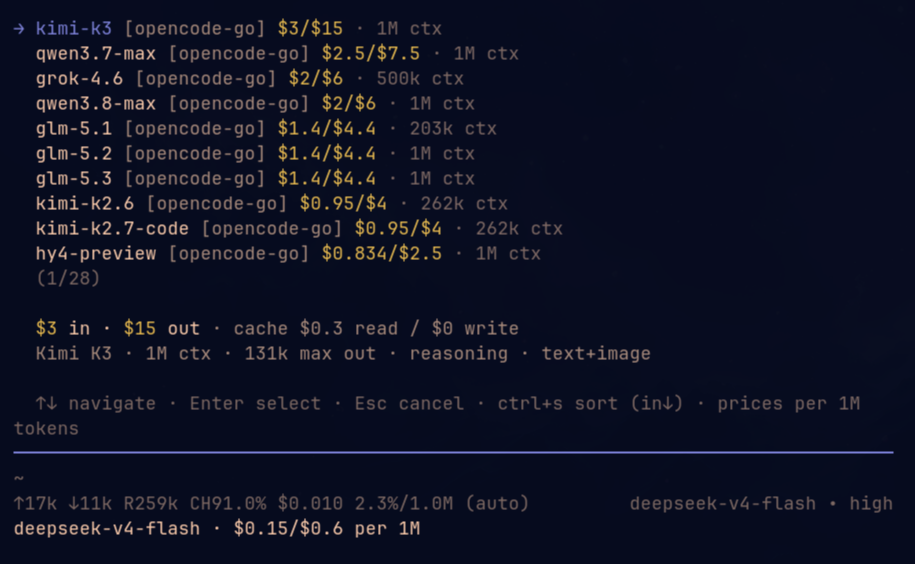

# model-costs

Pricing-aware model picker for **pi** (https://pi.dev). The built-in `/model`
selector does not show pricing — this extension adds a model picker that shows
the real cost of each model before you switch.

## Features

- **`/model-cost [query]`** — model picker with:
  - per-1M-token input/output cost
  - context window and max output tokens
  - cache read/write rates and pricing tiers
  - reasoning support and modality (text / text+image)
  - **`ctrl+s` cost sorting** — cycle through default, input ↑↓, output ↑↓
    and total (input + output) ↑↓; the active mode is shown in the footer
  - same flow as `/model`: arrows to navigate, type to fuzzy-filter, `Tab`
    toggles all/scoped (when scoped models are configured), `Enter` selects,
    `Esc` cancels
- **Footer status** — pricing of the currently active model in the footer
  (off by default; enable via settings.json — see Settings below).

In default order the current model is marked with a ✓ and sorted to the top;
cost sorts rank models purely by price (ties broken by provider/id).



## Settings

The footer status is off by default. Enable it with the `modelCosts`
settings key in settings.json:

```json
{
  "modelCosts": {
    "showStatus": true
  }
}
```

Add it to `~/.pi/agent/settings.json` (global, all projects) or
`.pi/settings.json` (current project). Project settings override global.

## Install

```bash
# from npm (recommended)
pi install npm:pi-model-costs

# from the gallery or a git repo
pi install git:github.com/MrDaGree/model-costs

# or, to try without installing:
pi -e npm:pi-model-costs
```

> Only interactive (`tui`) mode supports the custom picker. In print/RPC mode
> the command notifies you that it is unavailable.

## Usage

```bash
/model-cost              # browse all models
/model-cost claude       # fuzzy-filter by provider/id/name
/model-cost $0.00        # fuzzy-filter by cost
```

`/model-cost` extends the built-in `/model` selector; the actual model switch
still goes through pi's normal `setModel` path, so API keys are resolved the
same way.

## License

MIT
